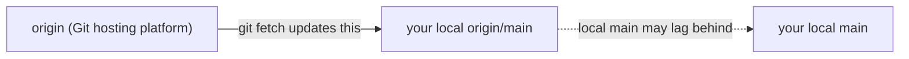

# My opinionated tips about Git

This is not an introduction to Git. Just some hints about how I use `git`.

Slides: <https://guettli.github.io/git-tips/>

## How to use this Git Repo

This repo contains some scripts in the [scripts](scripts) directory.

I add that directory to `$PATH` so the scripts are available everywhere.

Most of them use the [Bash Strict Mode](https://github.com/guettli/bash-strict-mode).

To generate HTML slides from this README into the `slides/` directory, run `task slides`.

## Git Hosting Providers

GitHub is very popular, but it is no the only Git hosting provider.

For example, Git itself does not know about pull requests (PRs). That concept was added by platforms
like GitHub, GitLab, and Codeberg.

Different platforms use different names for nearly the same thing:

- GitHub: pull request (PR)
- Codeberg: pull request (PR)
- GitLab: merge request (MR)
- Gerrit/Google: changelist (CL)

I use "pull request" as the generic term here, even if a platform uses a different name.

## One directory per PR

Imagine you work on one Git repo and there are three PRs. These PRs stay open for several days, so
constantly running `git switch` gets annoying.

The solution is simple: create several copies of your Git repo. Imagine your repo is called `foo`.

Then check out that repo four times:

- foo-main
- foo-pr-one
- foo-pr-two
- foo-pr-three

If you use VS Code, you can give each directory a different border color:

```json
{
  "workbench.colorCustomizations": {
    "statusBar.background": "#00ff51",
    "titleBar.activeBackground": "#00ff51",
    "titleBar.inactiveBackground": "#00ff51"
  }
}
```

That makes it easier to switch between PRs.

If you have a train of PRs, I like this mnemonic to remember the order:

- First PR: light blue (like "baby")
- Second PR: yellow (like "youth")
- Third PR: purple (like elderly)

## `checkout` -> `switch` + `restore`

The command `git checkout` is confusing, and no longer needed.

- `git switch` to switch to a different branch
- `git restore` to restore files

## `git diff` via Pager, not IDE

I use [pager delta](https://github.com/dandavison/delta), which shows `git diff` output with better
colors, so small changes in long lines are easier to spot.

I usualy do not use the git features of the IDE (vscode in most cases).

Depending on your system, the package is often called `git-delta`, but the
executable is called `delta`.

Examples:

```console
brew install git-delta
dnf install git-delta
cargo install git-delta
nix profile add nixpkgs#delta
```

Then configure Git to use it as `pager`:

```ini
[core]
    pager = delta

[interactive]
    diffFilter = delta --color-only

[delta]
    navigate = true
```

After that, commands like `git diff`, `git show`, `git log -p`, and `git add -p` will use delta.

Screenshot:


## How to Use Multiple Git Configs on One Computer

Imagine you have used only a personal GitHub account so far.

Now you want two identities on one computer: one for personal work and one for work-related repos.

Create two gitconfig files:

```console
cd $HOME
cp .gitconfig .gitconfig-personal
mv .gitconfig .gitconfig-work

# change the email address to your work address

code .gitconfig-work
```

Then create a new `~/.gitconfig`:

```console
code .gitconfig
```

Put this into it:

```ini
[includeIf "gitdir:~/personal/"]
  path = ~/.gitconfig-personal
[includeIf "gitdir:~/work/"]
  path = ~/.gitconfig-work
```

Source: [How to Use Multiple Git Configs on One
Computer](https://www.freecodecamp.org/news/how-to-handle-multiple-git-configurations-in-one-machine/)

## `git diff main` vs `git diff origin/main`

If you work on a branch that was created from `main`, you might want to compare your current work
against `main`. Similar to the view you see in web UIs like GitHub.



These two commands can show different results:

- `git diff main`: compare against your local `main`
- `git diff origin/main`: compare against your local remote-tracking ref for `origin/main`

If your local `main` is outdated, then `git diff main` can be misleading.

For example:

- maybe you have not switched to `main` for a week, and other developers have merge to main
  meanwhile.
- maybe you did not run `git pull` on `main`
- but `git fetch` already updated `origin/main`

If you want to compare against the current state of the remote main branch, use this sequence:

```console
git fetch
git diff origin/main
```

But note: `git diff origin/main` is still not the same as "show me only the changes from my branch
since it was created".

For that PR-like view, use the merge-base form:

```console
git fetch
git diff origin/main...
```

Why is this different?

- `git diff origin/main` compares your current work against the current tip of `origin/main`
- `git diff origin/main...` compares your current work against the merge base of your branch and
  `origin/main`

That is why `git diff origin/main...` is usually closer to what you see in a pull request: it shows
the changes on your branch since it diverged from `origin/main`.

## Merge upstream branch often

If your branch lives for more than a day or two, I prefer to merge the base branch into it
regularly.

This is especially useful before you continue working on an existing branch.

Why?

- conflicts stay small
- test failures show up earlier
- merge conflicts later are smaller and easier to resolve

I usually do this while I am on my feature branch:

```console
# Maybe someone else pushed to your branch. Get these change to your local directory
git pull

# Get changes from base branch. In most cases this is "main".
git merge origin/main
```

I use `origin/main` here instead of local `main` because local `main` might be outdated. A `git fetch`
updates `origin/main`, even if you have not switched to `main` or pulled it recently.

## Create a backup of a branch

```console
# Create a new branch
git switch -c foobar-backup

# Switch back from "foobar-backup" to the previous branch
git switch -
```

You could use [tagging](https://git-scm.com/book/en/v2/Git-Basics-Tagging) for this as well, but I
prefer this approach.

## Squash PRs

The easiest way to keep the Git history clean: Squash PRs.

- In your branch: Create as many commits as you like
- Do not rebase
- Don't force-push

At the end, just squash the PR into a single commit.

## List branches

[git-list-branches.sh](scripts/git-list-branches.sh)

This script shows local branches and `origin/<branch>` branches in one combined list.

It sorts them by recent activity and shows, for each branch:

- when the last commit happened
- the commit subject
- whether the local branch is synced with `origin`, ahead, behind, diverged, local-only, or remote-only

By default it runs `git fetch --prune origin` first, so the view is based on fresh remote-tracking
refs.

## Switch back to previous branch

Often I want to switch between two branches. This is handy:

`git switch -`

This switches to the previous branch. And to get back ... again `git switch -`.

Like `cd -` in the bash shell.

## git stash

`git stash` is like a backpack.

Example: You started to code. Then you realize (before you commit) that you work on the main branch.
But you want to move that work onto a feature branch first. You can `git stash` your uncommitted
changes, switch to or create the branch you actually want, and then use `git stash pop` to bring the
changes back.

## Accidentally Commit on Branch `main`

You accidentally created a commit on your local main branch. That was a mistake because every change
should be done via a pull request. You have not pushed your changes yet.

Solution: create a feature branch, delete your local `main`, and recreate it from `origin`.

```console
# Create the branch you want to use for your feature.
git switch -c feature-foo

# Delete your `main` branch.
# Relax: You still have the "main" branch on origin (like Github/Gitlab/Codeberg/...)
git branch -D main

# re-create branch "main" from origin
git switch main

# Now develop on your feature branch.
git switch feature-foo
```

## Restore a single file

Imagine you are working on a feature branch. But you want to restore one file to the original
version of the main branch.

```console
git restore -s main path/to/file
```

`s` like "source branch"

(avoid `git checkout`)

## Restore interactively

Imagine you are working on a feature branch. But you want to restore some changes to the original
version of the main branch. You want to do that interactively because some changes in the file
should stay. Use `-p` like "patch":

```console
git restore -s main -p -- path/to/file.txt
```

This works for directories, too:

```console
git restore -s main -p -- path/to/dir
```

## `git diff` of pull-request

You work on a PR, and you execute:

```console
git diff origin/main
```

But this might look very different from what you see in the web UI of your Git hosting provider.

That simple `git diff` command might show a lot of changes that happened on `origin/main` since you
created the branch. You do not want to see those changes.

What was changed on your branch since the branch was created?

```console
git diff origin/main...
```

Unfortunately this does not show your local changes, which are not committed yet.

To see them, too:

```text
git diff "$(git merge-base origin/main HEAD)"
```

## Show Changes to a single file

```console
git log foo.txt
```

... shows you the commits which changes the file.

But it shows you only the commit message. If you want to see the changes which were done, you need
to use `-p` (like patch):

```console
git log -p foo.txt
```

## Find removed code

You are looking for a variable/method/class name which was in the code once, but which is no longer
in the current code.

Which commit removed or renamed it?

`git log -G my_name`

Difference to `-S`:

- `-G my_name`: find commits where added or removed lines match the regex
- `-S my_name`: find commits where the number of occurrences of the exact string changed

I use `-G` more often for code archaeology, because renames or rewritten lines are easier to find.

Attention: `git log -G=foo` will search for `=foo` (and I guess that is not what you wanted).

If you know a co-worker introduced a variable/method/class, but it is not in your code, and `git log
-G my_name` does not help, then you can use `git log --all -G my_name`. This will search in all
branches.

## Find branch which contains a commit

You found a commit (maybe via `git log -G ...`) and now you want to know which branches contain this
commit:

`git branch --contains 684d9cc74d2`

Works for git tags, too:

`git tag --contains 684d9cc74d2`

## `gitk`

`gitk` is the native GUI for browsing Git history.

I do not use it often, but if you want a quick graphical overview, it is practical and usually good
enough.

Common usages:

```console
# Usual default: show all local branches, remote-tracking branches, and tags
gitk --all

# Focus on a few branches only
gitk main my-feature-branch

# Inspect the history of one file across all branches
gitk --all -- path/to/file
```

I think `--all` makes sense in most repos. Without it, `gitk` only shows the history reachable from
the current branch, which is often too narrow.

The exception is a huge repo: then `--all` can become noisy or slow, and it is better to limit by
date, branch, or path.

## I don't care much for git history

Many developers like to investigate the Git history.

I almost never do this.

If you need to inspect the Git history graph often, then that is usually a smell: something is off
in the way the work gets sliced.

If you are in a hurry, go slowly.

Avoid long-living branches. Release early, release often. Then the Git history usually does not
matter much, because each step stays small and easy to understand.

## rebase vs merge

My default workflow:

- While the PR is open, merge the base branch into the feature branch.
- When the PR gets merged, squash it into one commit on `main`. This is usually done via the web UI.

With that workflow, I rarely need `rebase`.

## List all files

Git directories often contain a lot of auto-created files. For example files created by tests.

If you want to use `grep` on all files which get tracked by git, you can use this:

```console
git ls-files | grep -vP 'exclude1|exclude2' | xargs -r -d'\n' grep -nP '...'
```

In detail:

- `git ls-files` list all files which are tracked in git.
- `grep -vP 'exclude1|exclude2'` (optional): exclude some lines from the stream
  of file names.
- `xargs -r -d'\n'` for every line in stdin stream do ...
- `grep -nP '...'` search in the file for a pattern. The `-n` displays the line number. This is
  handy if you start the command from the terminal of your IDE, then you can click on the output
  (like `myfile.go:42`) to jump to the matching line in your IDE.

You can give `ls-files` a glob expression. This matches the whole filename (including the parent
directories).

## Autocompletion

If you configured auto-completion, you can easily get a list of branches if you know the first
characters of the branch name:

```console
git switch branch[TAB]
 --->        branch-foo
 --->        branch-bar
 --->        ...
```

[git-switch-branches.sh](scripts/git-switch-branches.sh)

This is a small interactive branch switcher based on `fzf`. It shows local and remote branches in
one list, previews recent commits, and if you select a remote-only branch it creates the local
tracking branch for you.

## Solving Conflicts with `meld`

I am on a branch that was created from the main branch.

Now I want to merge the new main branch into my branch again.

But someone else changed parts which I also changed on my branch.

There is a conflict.

```console
❯ git fetch
❯ git merge origin/main

Auto-merging internal/foo/api/v1beta1/mycrd_types.go
CONFLICT (content): Merge conflict in internal/foo/api/v1beta1/mycrd_types.go
```

I use `meld` for solving conflicts.

Be sure to set this option first:

```console
git config --global mergetool.meld.useAutoMerge true

git mergetool --tool=meld
```

Now a nice UI opens, and you will see three columns:

- On the left side, you see your original code (before starting the merge).
- In the middle, you see the result of the automatic merges done by Git.
- On the right side, you see "theirs" (new main branch).

The green and blue parts are automatically resolved. You do not modify these in most cases.

You will see conflicts marked with a red background. In the middle column of a conflict line, you
see `(??)`.

You can take the left (your side), the right side (theirs), or modify the code manually.

Finally, go to the middle column and press `Ctrl+S` to save your changes. Then close the UI. The UI
will reopen if there is a second file with a conflict.

I have tried several other tools, but `meld` (with useAutoMerge) is still my favorite.

## Solving Conflicts: Overview

Before solving a complex Git merge conflict, it is convenient to have an overview:

> What changed between the base and the remote, and what changed between the base and your local
> version?

I found no tool which does this, so I use that small Bash script
[git-conflict-overview.sh](scripts/git-conflict-overview.sh).

The script opens two diffs for one conflicted file:

- `BASE` vs `LOCAL`
- `BASE` vs `REMOTE`

Then it opens `git mergetool` for that file.

That gives me a quick overview of what my branch changed and what the upstream branch changed
before I resolve the conflict.

Now I can choose the simpler change first, then apply the more complex change to the file, and
after that I apply the simpler change by hand.

I use `git mergetool` with `meld`. See the previous section.


`BASE` vs `LOCAL`: this shows what changed on my branch compared to the common ancestor.


`BASE` vs `REMOTE`: this shows what changed on the upstream branch compared to the common ancestor.


`git mergetool` with `meld`: after reviewing both diffs, I resolve the conflict in the three-way
merge view and save the middle pane.

---

If you want to test it, use this Git repo (git-tips), then:

```console
git switch dummy-branch-to-create-conflict

git merge dummy-branch-to-create-conflict

dummy-branch-to-create-conflict
```

## Misc: Search with Editor, not with your eyes

Not related to Git, but still helpful: do not search through code with your eyes all day. Use your
IDE.

For example, I mark a place with `ööö` (German umlauts) when I want to jump back to that point
later. Of course this should never be committed.

Code editors have fancy plugins for this, too. But somehow this simple pattern works well for me.

## Misc: ripgrep: recursive grep which respects .gitignore

[ripgrep](https://github.com/BurntSushi/ripgrep): recursive grep which respects .gitignore

Handy if there are huge directories in your Git repo that you usually want to skip.

## Misc: atuin

[atuin](https://atuin.sh/) is a shell history tool with very good search.

This is handy for Git because many useful commands are too rare to memorize exactly. Instead of
retyping them or scrolling through old terminals, press `Ctrl-r` and search your history.

It helps me find commands like `git restore ...`, `git diff ...`, or some complicated `git log`
invocation that worked before.

## git diff shows no changes?

Sometimes `git diff` shows no changes, although you expected to see changes.

It is likely that your changes are already staged (for example you resolved a merge conflict).

Run `git status` to see if you have staged changes.

You need to use `git diff --staged` to see your changes.

## Automatically prune on fetch

```console
git config --global fetch.prune true
```

It sets a global Git config so every git fetch will prune stale remote-tracking branches—i.e., it
automatically deletes local refs like origin/foobar when they’ve been removed from the remote.

## Pick some lines from another branch with `git difftool`

Imagine you want to take some changes of a different branch into your code.

If you care about the lines of code, not the commits, then you can use the following way to get the
changed lines into your code.

Switch to the branch that should be updated.

```console
git difftool other-branch -- your-file.txt
```

This will open `meld` and you can take some lines to your local version.

This is related to [Restore interactively](#restore-interactively), but the use case is different:

- `git restore -p -s other-branch your-file.txt`: interactively restore selected hunks from
  `other-branch`
- `git difftool other-branch -- your-file.txt`: inspect another branch side by side and copy over
  only the lines you want

## pre-commit.com

I use [pre-commit.com](//pre-commit.com).

It is a simple way to run checks automatically before creating a commit.

That means:

- feedback comes early
- trivial issues get caught before CI
- the local workflow gets closer to the CI workflow

Example from this repo: [.pre-commit-config.yaml](.pre-commit-config.yaml)

## gitleaks via pre-commit

This repo uses `gitleaks` in `.pre-commit-config.yaml`.

It is a big risk that credentials get accidentally added to Git and then get pushed. Especially in
open source projects.

Why in `pre-commit` and not only in CI?

- The feedback is immediate. You notice accidental secrets before they leave your laptop.
- It is cheaper to fix. Amending a local commit is easier than cleaning up after a pushed secret.
- It protects all commits, not only the branch which later gets CI.

I use `gitleaks` here because it is a maintained general-purpose secret scanner and its license is
MIT.

## Public `.envrc` file, private `.env` file

I use [direnv](https://direnv.net/) to manage environments. `direnv` uses `.envrc` files to set
environment variables.

But for secrets I use `.env` files.

Example:

```bash
# shellcheck shell=bash

# .envrc file of direnv.
# If you use VS Code, please use the `direnv` extension.

# Use nix-direnv
# https://github.com/nix-community/nix-direnv
# Ensures that flake.nix gets evaluated.
use flake

PATH_add scripts
PATH_add node_modules/.bin

# Load variables from .env
dotenv_if_exists
```

I never want the `.env` file to be part of a Git repo, because it usually contains credentials (for
example `GITHUB_TOKEN`).

To prevent accidental commits of `.env` files in all your Git repositories, you can set up a global
`.gitignore` file like above, and add `.env` to the file.

## Long branch names are fine

I think it is perfectly fine to have long branch names like:

```text
tg/check-workspace-providers-on-create-of-apc--based-on-disallow-change-of-controlplane-location
```

## GitHub: Tab width: 4

If you use tabs for indentation (for example in Golang), then you might want to change the default
tab width from 8 to 4: <https://github.com/settings/appearance>

## GitHub: open PR in web UI

This command opens the current PR in your browser:

```console
gh pr view --web
```

## GitHub: Play a sound when a CI job is finished

Sometimes I need to wait until a GitHub CI job is finished. Waiting is not very productive, so I do
other things while waiting.

When the job is done, I want to get notified. This can be done like this:

```console
gh run watch; music
```

`gh run watch` gives you a list of jobs, and you can select one. When it is finished, the next
command runs. Use whatever command you want for that. For me, `music` is a small script that plays a
song I like.

## GitHub: Keep Actions/Workflows simple

I prefer to keep GitHub Action workflows simple. I like that GitHub does CI for me, but third-party
GitHub Actions have the drawback that I often cannot reproduce them on my local machine.

There are tools like [act](https://github.com/nektos/act), but they often did not work for me.

Keep things simple by using a reliable Bash script in [Bash Strict
Mode](https://github.com/guettli/bash-strict-mode).

This works in GitHub CI and on my local Linux device.

## VS Code: autoFetch

I like the VS Code Git [`autoFetch`
setting](https://code.visualstudio.com/docs/sourcecontrol/overview#_remotes). This fetches the
latest changes from the remote every N seconds.

This is handy because I see `[behind]` via [my Starship prompt Git config](#starship-prompt).

## Starship Prompt

I use [Starship Prompt](https://starship.rs/config/#git-status) so I get notified in the prompt when
the Git status is not clean.

My config:

```toml
[git_status]
conflicted = ' conflicted'
ahead = ' ahead'
behind = ' behind'
diverged = ' diverged'
up_to_date = ''
stashed = ' stashes'
untracked = ' untracked'
```

This shows nothing when the Git state is clean and a readable warning when something is wrong.

Official screenshot:


## restore, revert, reset

These three commands all start with `re`, so new Git users often mix them up.

The order above is intentional. It goes from safer and more local to more dangerous:

- `restore`: restore **files**
- `revert`: reverse a **commit** by adding a new commit
- `reset`: re-set the **branch pointer**

Rough mental model:

- `restore` changes files in your working tree or index.
- `revert` keeps history intact and records a new commit that undoes an older one.
- `reset` moves `HEAD` and usually the current branch.

Examples:

```console
# Restore one file from main.
git restore -s main path/to/file

# Undo an old commit safely by creating a new commit.
# Both the old commit and the new undo commit stay in the history.
git revert <commit-hash>

# Move HEAD and the current branch back by one commit.
git reset --hard HEAD~1
```

If you are unsure, use `restore` for files and `revert` for published history.

Be careful with `reset`, especially after pushing. If unsure, use `revert`, not `reset`.

## delete merged branches

After some months there are too many old branches. Time to clean up.

This deletes all branches that are fully merged. It only deletes local branches.

```console
❯ git branch --merged \
  | grep -Pv '^\s*(\*|master|main|staging)' \
  | xargs -r git branch -d
```

There will still be several branches left that are not merged yet. No script can decide whether they
can be deleted or not.

Use `git push origin --delete branch-name` to delete the remote branch itself. `git branch -rd
origin/branch-name` only deletes your local remote-tracking ref.

## git bisect

`git bisect` is a great tool in combination with unit tests. It makes it easy to find the commit
that introduced a bug. Unfortunately, it is not a one-liner. You can use it like this:

```console
user@host> git bisect start HEAD HEAD~10


user@host> git bisect run py.test -k test_something
 ...
c8bed9b56861ea626833637e11a216555d7e7414 is the first bad commit
Author: ...
```

But if your pull requests get tested before they get merged in continuous integration, you hardly
need `git bisect`.

## git bisect for lazy people

This walks the git history down from the current commit to the older commits.

Copy and adapt for your needs.

```bash
#!/bin/bash

BRANCH=your_branch

set -euxo pipefail
log_report() {
    echo "Error on line $1"
}
trap 'log_report $LINENO' ERR


git switch $BRANCH
git log --oneline | cut -d' ' -f1 | while read hash;
    do
    echo
    echo    $hash;
    git switch -d $hash
    DO_SOMETHING
    if YOUR_COMMAND; then
        echo "this is good (the commit above this introduced the bug): $hash"
        break
    fi
    git restore .
    sleep 1
done
git switch $BRANCH
```

You need to adapt these parts:

- BRANCH
- DO_SOMETHING
- YOUR_COMMAND: Should return `0` if everything is fine.
- remove "sleep 1", if you need to walk back a lot of commits.

## Squash all commits into a single commit

Unfortunately, in Kubernetes-related projects, squash via GitHub as described in [Squash
PRs](#squash-prs) is disabled.

See [PR Guidelines](https://www.kubernetes.dev/docs/guide/pull-requests/#squashing).

`git rebase -i HEAD~N` works fine, except when you merged the main branch into your branch after
creating the branch. Then your branch will contain merge commits, and the normal procedure won't
work.

You can use `git reset --soft` and then create a new commit that contains all the changes between
`origin/main` and `your-pr-branch`.

```console
git fetch
git switch your-pr-branch

# create a backup, just in case something goes wrong
git switch -c your-pr-branch-backup

# switch back to your-pr-branch
git switch -

# If you want to copy commit messages from your branch,
# then copy them now. After the following command, you need
# to look into your backup branch.
git reset --soft origin/main
git commit
git push --force-with-lease
```

## Empty commit

Most web-GUIs of CI-systems have a "retry" button. But sometimes this does not work, or you don't
want to leave your context.

```console
git commit --allow-empty -m "Trigger CI"
```

## Show one commit in difftool

Imagine you want to review one old commit side by side in a GUI diff tool.

Usually I start with `git show 8d73caed` in the terminal.

If you want a side-by-side view, use `git difftool` with the commit and its parent:

```console
git difftool 8d73caed^ 8d73caed
```

`^` means "the parent commit of 8d73caed".

This launches [meld](https://meldmerge.org/) if it is installed, or your preferred diff tool. See
[git-difftool](https://git-scm.com/docs/git-difftool).

## Resolve, take theirs

You merged a branch into your branch, and now you have conflicts. You want to discard your change,
and take their changes:

```console
git restore --theirs path/to/file
```

## git log over many git repos

You have a directory called "all-repos". It contains many Git repos. Now you want to use `git log -G
FooBar` across all of them. You only want to search for commits that were created during the last 8
months, and you want to sort the result by commit timestamp.

A bit ugly, but works:

```console
for repo in *; do (
  cd "$repo"
  git log -G FooBar --all --pretty="%ad %h in $repo by %an, %s" \
    --date=iso --since="$(date -d "8 months ago" --iso)"
); done | sort -r | head
```

## Merging some parts of a different branch

I like [Meld](https://meldmerge.org/), which is a visual diff and merge tool.

Imagine I changed several parts of a file. Now I realize that some parts are good and should stay,
while others should be removed again.

I am on a feature branch that was created from "main".

```console
# Create a copy of the file
cp my-dir/my-file.xyz ~/tmp/

# restore the file to the original version
git restore -s main my-dir/my-file.xyz

meld my-dir/my-file.xyz ~/tmp/my-file.xyz
```

Now Meld opens and I can easily choose which parts I want to take into my branch, and which parts I
don't need.

---

Imagine you created one PR containing several changes. Now you decide that you want to create three
PRs instead.

First, create a backup of your branch:

```console
git switch -c my-backup; git switch -
```

Create the branch for the first feature, create a copy of your whole directory, and switch the copy
to main:

```console
git switch -c feature-1
cd ..
cp -a myrepo myrepo-main
cd myrepo-main
git switch main
git pull
```

Now launch `meld`:

```console
cd ..
meld myrepo-main myrepo
```

Now you can easily remove all changes that belong to feature-2 and feature-3.

I tried that with VS Code, but `meld` is more usable for this. You can copy files between both
directories with the context menu.

You can accept (click on arrow) or reject (shift-click) single changes.

## Show change of merge commit

This shows no changes for merge commits:

```console
git show <commit-hash>
```

Use:

```console
git show -m <commit-hash>
```

The output of the command above has several parts: one part for each parent commit.

## cherry-pick -n

`git cherry-pick ...` creates a new commit automatically. Sometimes you don't want only some changes
of the original commit.

You can use `--no-commit` (short form: `-n`) to apply the changes without creating a commit
immediately. Then you can modify the result and commit manually.

```console
git cherry-pick --no-commit <commit-hash>
```

## parent branch / base branch

Unfortunately, it is not possible to find the name of the parent/base branch.

Git stores commits and pointers, not branch ancestry.

That means:

- a branch is just a movable name that points to one commit
- Git knows commit parents, but not "this branch was created from that branch"
- after more commits, rebases, merges, or deleted branches, that information is gone

But Git cannot reliably tell you:

- "feature-2 was created from feature-1"

If you are not asking Git about branch ancestry, but the hosting platform about the current PR, then
CLI tools can help:

- GitHub: `gh pr view --json baseRefName --jq .baseRefName`
- GitLab: `glab mr view --output json | jq -r .target_branch`
- Codeberg/Forgejo/Gitea: ...

## Merge PR base branch into current branch

[`scripts/git-merge-pr-base.sh`](scripts/git-merge-pr-base.sh)

Git itself does not know "this branch was originally created from that branch". But GitHub knows
the base branch of the current pull request.

This script uses `gh pr view` to resolve that base branch, fetches it, then merges it into your
current branch.

That is useful if you want to refresh your branch with the latest changes from the branch your PR
targets, without typing `main` or another branch name.

This is especially handy if you work with a chain/train of branches, because the base branch is not
always `main`.

By default it fetches the PR base branch first, so the merge uses a fresh remote-tracking ref. Use
`--no-fetch` if you want to skip that step.

## Undelete a branch

Imagine you accidentally deleted a branch:

```console
❯ git branch -D foo-branch
Deleted branch foo-branch (was d885d38).
```

Oh my god! What have I done?

Relax, you can easily create the branch again.

```console
❯ git switch --detach d885d38
❯ git switch -c foo-branch
```

## Taskfile stamp files per task name

If several independent Taskfile tasks watch the same directory, they should not share a single stamp
file. [`scripts/git-worktree-has-changed.sh`](scripts/git-worktree-has-changed.sh) therefore
requires a task name before the path:

```yaml
version: "3"

tasks:
  lint:
    status:
      - bash ./scripts/git-worktree-has-changed.sh lint .
    cmds:
      - bash ./internal/lint.sh
      - bash ./scripts/git-worktree-has-changed.sh --touch-stamp lint .
```

The task name becomes part of the stamp filename in `.tmp/`. Non filename-safe characters get
replaced with underscores.

## Git submodules

I try to avoid Git submodules.

## Chain of branches: Add base branch to name of second branch

Sometimes you create a chain or train of branches. The first branch is still in review, but you
start to work on the next items in a second branch.

This gets confusing if you have several branches in this chain.

To make things easier to understand, I sometimes add the base branch name to the name of the second
branch.

First branch: `foo`

Then I call the second branch: `name-of-second-branch--based-on-foo`.

The third would be: `name-of-third-branch--based-on-name-of-second-branch`.

And so on.

## History for selection

I do 95% of my git actions on the command-line. But "history for selection" is super cool. It is a
feature of IntelliJ-based IDEs. You can select a region in the code and then you can have a look at
the history of this region.

On the command line, the closest things I know are:

- `git blame -L 120,150 some-file`: show who last changed lines 120 to 150
- `git log -L 120,150:some-file`: show the history of that line range as patches
- `git log -L :my_function:some-file`: show the history of one function

This is still not as convenient as the IntelliJ IDE solution, because on the command line you need
line numbers or a function name first.

I switched to VS Code several years ago, but still miss this feature.

If you know how to get that in VS Code, please tell me.

## Which line ignores a file?

You have a file `foo/bar.baz` that is being ignored by a line in a `.gitignore`.

But you are unsure which line is responsible for ignoring this file.

You can use `git check-ignore -v`:

```console
❯ git check-ignore -v foo/bar.baz
.gitignore:23:foo/*.baz foo/bar.baz
```

## More

- [Bash Strict Mode](https://github.com/guettli/bash-strict-mode)
- [How I use Direnv](https://github.com/guettli/How-I-use-direnv/)
- [Switching to Nix](https://github.com/guettli/switching-to-nix)
- [Thomas WOL: Working out Loud](https://github.com/guettli/wol)
